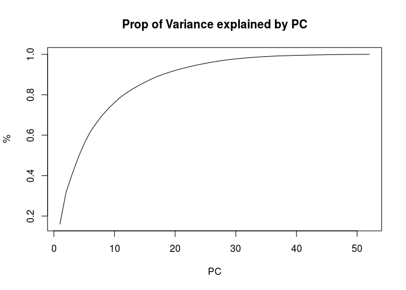

Download data files
===================

``` r
if (!file.exists("pml-training.csv")) {
  fileUrl<-"https://d396qusza40orc.cloudfront.net/predmachlearn/pml-training.csv"
  download.file(fileUrl, "pml-training.csv", method="curl")

  fileUrl <- "https://d396qusza40orc.cloudfront.net/predmachlearn/pml-testing.csv"
  download.file(fileUrl, "pml-testing.csv", method="curl")
}

library(dplyr)
```

    ## 
    ## Attaching package: 'dplyr'

    ## The following objects are masked from 'package:stats':
    ## 
    ##     filter, lag

    ## The following objects are masked from 'package:base':
    ## 
    ##     intersect, setdiff, setequal, union

``` r
library(caret)
```

    ## Loading required package: lattice

    ## Loading required package: ggplot2

Read data
=========

``` r
nachar = c("NA", "", "#DIV/0!")
training_raw <- read.csv("pml-training.csv", stringsAsFactors=FALSE, na.strings = nachar)
testing_raw <- read.csv("pml-testing.csv", stringsAsFactors=FALSE, na.strings = nachar)
```

Data cleaning
=============

Remove columns with all na
--------------------------

As the first step of cleaning data, we remove empty columns, as well as other columns which are not used in the prediction such as user name

``` r
training_raw <- training_raw[,!apply(is.na(training_raw), 2, all)]

exclude <- c("X", "num_window", "user_name", "raw_timestamp_part_1", 
             "raw_timestamp_part_2", "cvtd_timestamp", "new_window")
training <- training_raw %>%
  dplyr::select(-one_of(exclude))
```

Remove columns with lack of data
--------------------------------

As some of the columns have very low frequency of data, they would not be useful to our prediction, hence we remove them

``` r
dataCount <- sapply(training, function(x) sum(!is.na(x)))
training <- training[, which(dataCount > 1000)]
```

Remove unnecessary columns in testing dataframe
-----------------------------------------------

Next we ensure that all the corresponding columns in the test set is also removed

``` r
testing <- testing_raw[, names(testing_raw) %in% names(training)]
```

Convert data type
-----------------

We then convert all the data to numeric, as the objective column as factor

``` r
training <- training %>% 
  mutate_if(is.integer, as.numeric) %>%
  mutate(classe = as.factor(classe)) %>%
  na.omit

testing <- testing %>%
  mutate_if(is.integer, as.numeric) 
```

Break into training and cross validation set
============================================

``` r
inTrain <- createDataPartition(training$classe, p = 0.8)[[1]]
cvset <- training[-inTrain,]
training <- training[ inTrain,]
```

Training
========

Calculate principal components
------------------------------

Due to the large number of predictive variables, it would be more efficient to use principal component analysis to reduce the number of factors in the predictive model. From the plot, we see that 5 factors explain about 60% of the variance. We will start with 5 factors so that training will not take too long, if the results are poor, we can then include more factors.

``` r
components <- prcomp(training[,-ncol(training)], scale=TRUE)
propExplained <- cumsum(components$sdev**2/sum(components$sdev**2))
plot(propExplained, main="Prop of Variance explained by PC",
     xlab = "PC", ylab = "%", type="l")
```



Use up to PC5 to train
----------------------

We preprocess the data to extract the 5 principal components, then pass it through an Linear Discriminant Analysis, a model for multiclass classification.

``` r
set.seed(62433)
preProc <- preProcess(training, method="pca", pcaComp=5)
trainPC <- predict(preProc, training)

modelFit <- train(x = trainPC[,-1], y=training$classe, model="lda")
```

    ## randomForest 4.6-12

    ## Type rfNews() to see new features/changes/bug fixes.

    ## 
    ## Attaching package: 'randomForest'

    ## The following object is masked from 'package:ggplot2':
    ## 
    ##     margin

    ## The following object is masked from 'package:dplyr':
    ## 
    ##     combine

Predict for Train (In sample results)
=====================================

We see that the in sample training yields great results, with the accuracy being a whooping 100%

``` r
predictTrain <- predict(modelFit, trainPC)
confusionMatrix(training$classe, predictTrain)
```

    ## Confusion Matrix and Statistics
    ## 
    ##           Reference
    ## Prediction    A    B    C    D    E
    ##          A 4464    0    0    0    0
    ##          B    0 3038    0    0    0
    ##          C    0    0 2738    0    0
    ##          D    0    0    0 2573    0
    ##          E    0    0    0    0 2886
    ## 
    ## Overall Statistics
    ##                                      
    ##                Accuracy : 1          
    ##                  95% CI : (0.9998, 1)
    ##     No Information Rate : 0.2843     
    ##     P-Value [Acc > NIR] : < 2.2e-16  
    ##                                      
    ##                   Kappa : 1          
    ##  Mcnemar's Test P-Value : NA         
    ## 
    ## Statistics by Class:
    ## 
    ##                      Class: A Class: B Class: C Class: D Class: E
    ## Sensitivity            1.0000   1.0000   1.0000   1.0000   1.0000
    ## Specificity            1.0000   1.0000   1.0000   1.0000   1.0000
    ## Pos Pred Value         1.0000   1.0000   1.0000   1.0000   1.0000
    ## Neg Pred Value         1.0000   1.0000   1.0000   1.0000   1.0000
    ## Prevalence             0.2843   0.1935   0.1744   0.1639   0.1838
    ## Detection Rate         0.2843   0.1935   0.1744   0.1639   0.1838
    ## Detection Prevalence   0.2843   0.1935   0.1744   0.1639   0.1838
    ## Balanced Accuracy      1.0000   1.0000   1.0000   1.0000   1.0000

Cross validation
================

Next we perform a cross validation to check for overfitting. We can see there's a fair bit of overfitting as the accuracy of the cross validation set is only 84%, not quite close to the 100% obtained on the training set

``` r
cvPC <- predict(preProc, cvset)
predictCv <- predict(modelFit, cvPC)
confusionMatrix(cvset$classe, predictCv)
```

    ## Confusion Matrix and Statistics
    ## 
    ##           Reference
    ## Prediction   A   B   C   D   E
    ##          A 996  22  43  32  23
    ##          B  58 610  46  24  21
    ##          C  44  36 553  41  10
    ##          D  32  19  37 539  16
    ##          E  25  29  18  22 627
    ## 
    ## Overall Statistics
    ##                                           
    ##                Accuracy : 0.8476          
    ##                  95% CI : (0.8359, 0.8587)
    ##     No Information Rate : 0.2944          
    ##     P-Value [Acc > NIR] : < 2e-16         
    ##                                           
    ##                   Kappa : 0.807           
    ##  Mcnemar's Test P-Value : 0.01145         
    ## 
    ## Statistics by Class:
    ## 
    ##                      Class: A Class: B Class: C Class: D Class: E
    ## Sensitivity            0.8623   0.8520   0.7934   0.8191   0.8996
    ## Specificity            0.9566   0.9535   0.9594   0.9681   0.9709
    ## Pos Pred Value         0.8925   0.8037   0.8085   0.8383   0.8696
    ## Neg Pred Value         0.9434   0.9665   0.9555   0.9637   0.9781
    ## Prevalence             0.2944   0.1825   0.1777   0.1677   0.1777
    ## Detection Rate         0.2539   0.1555   0.1410   0.1374   0.1598
    ## Detection Prevalence   0.2845   0.1935   0.1744   0.1639   0.1838
    ## Balanced Accuracy      0.9095   0.9027   0.8764   0.8936   0.9352

Cross validation set error
--------------------------

``` r
cv_error <- mean(predictCv == cvset$classe)
sprintf("Cross validation set error = %.2f%%", (1-cv_error)*100)
```

    ## [1] "Cross validation set error = 15.24%"

Predict test sets
=================

Finally we predict the test sets and submit the results!

``` r
testPC <- predict(preProc, testing)
predictTest <- predict(modelFit, testPC)
data.frame(qn = 1:20, predictTest = predictTest)
```

    ##    qn predictTest
    ## 1   1           B
    ## 2   2           A
    ## 3   3           B
    ## 4   4           A
    ## 5   5           A
    ## 6   6           E
    ## 7   7           D
    ## 8   8           B
    ## 9   9           A
    ## 10 10           A
    ## 11 11           A
    ## 12 12           C
    ## 13 13           B
    ## 14 14           A
    ## 15 15           E
    ## 16 16           E
    ## 17 17           A
    ## 18 18           B
    ## 19 19           B
    ## 20 20           B
